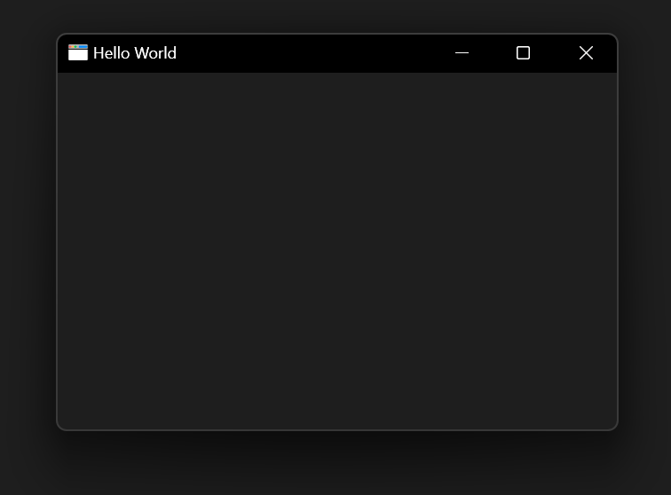

# NWindows [](https://github.com/xoofx/NWindows/actions) [](https://www.nuget.org/packages/NWindows/)


NWindows is a cross-platform window creation and management library for .NET.

> NWindows is aimed to provide all the infrastructure to manipulate a Window in a cross-platform manner and to interact with the input.
>
> It is **primarily meant to be used to create higher level applications** (games, multimedia apps) or **UI Frameworks**.
>
> NOTICE: The first version is only supporting the Windows 10+ platform. Help wanted for other platforms! 🤗

## Features

- Very **lightweight** with **zero-dependencies** `.NET 7+` library.
- **GC friendly** (Zero allocation for the events).
- **NativeAOT/trimmable library** (including the "reflection free mode")
  - You can create a small app under 1.5 MB.
- Create **top-level** and **popup windows**.
  - Support for **border-less** windows.
  - Support for OS **theme** sync.
- **Input support**: keyboard, mouse + cursor, text.
- **DPI aware** and sync with OS changes.
- **Clipboard** and **Drag&Drop** support.
- **FullScreen** mode support.
- **Many modifiable properties with events**
  - Size, position, visibility, maximize/minimum size, icon, resize-able, minimize-able, maximize-able, top-most, opacity, modal...
- **Screen** properties.
- **Dispatcher threading infrastructure** built-in to handle System and Window messages (similar to WPF Dispatcher)
- **Timer** support
## Getting started

```c#
using NWindows;
using NWindows.Threading;
using System.Drawing;

var mainWindow = Window.Create(new()
{
    Title = "Hello World",
    StartPosition = WindowStartPosition.CenterScreen,
    BackgroundColor = WindowSettings.Theme == WindowTheme.Light
        ? Color.FromArgb(245, 245, 245)
        : Color.FromArgb(30, 30, 30)
});

Dispatcher.Current.Run();
```

will create the following window on Windows:



You will find more examples in the [sample folder](samples/readme.md).

## Install

NWindows is provided as a [NuGet package](https://www.nuget.org/packages/NWindows/).

## User Guide

For more details on how to use NWindows, please visit the [user guide](https://github.com/xoofx/NWindows/blob/main/doc/readme.md).

## License

This software is released under the [BSD-2-Clause license](https://opensource.org/licenses/BSD-2-Clause). 

## Credits

NWindows is using the following libraries:

- The fantastic [TerraFX.Interop.Windows](https://github.com/terrafx/terrafx.interop.windows) for the interop layer with Windows API. 
  > This library is integrated with a [custom codegen Roslyn tool](src/NWindows.Terrafx.Interop.CodeGen/Program.cs) that will copy all the transitive usage of TerraFX and internalize them into this repository to avoid the the whole TerraFX library to be visible to NWindows's users.
  > 
  > In the end, this copy is only adding 45KB of .NET code to NWindows instead of the 15MB dependency of the whole TerraFX library.

## Author

Alexandre Mutel aka [xoofx](https://xoofx.github.io).
