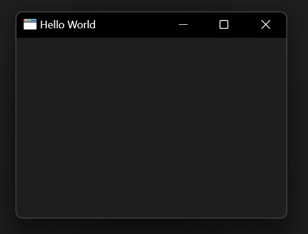
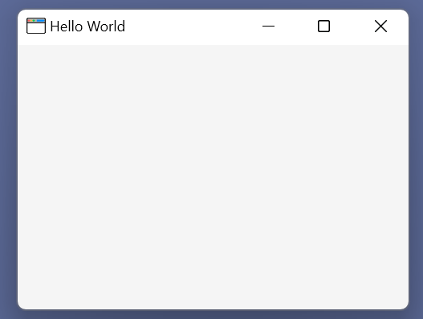
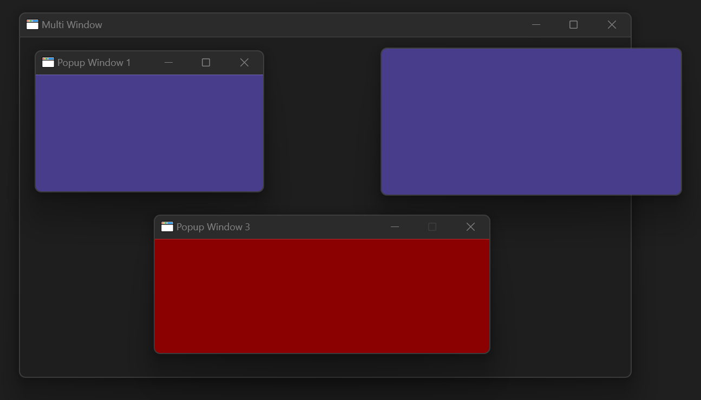
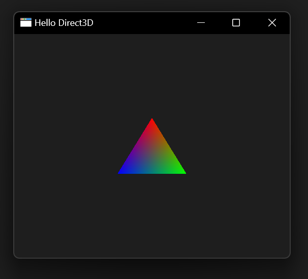

# NWindows Samples

Here is a list of a few samples available:

- [HelloWorld](HelloWorld/Program.cs)
- [MultiWindow](MultiWindow/Program.cs)
- [HelloDirect3D](HelloDirect3D/Program.cs)

## HelloWorld

Simple app with a main Window and listening to some events.

## MultiWindow

Simple app with a main Window and popup Windows, with decorations on/off

## HelloDirect3D

Simple app that draws a triangle on a main Window by using Direct3D11 with [TerraFX.Interop.Windows](https://github.com/terrafx/terrafx.interop.windows).

